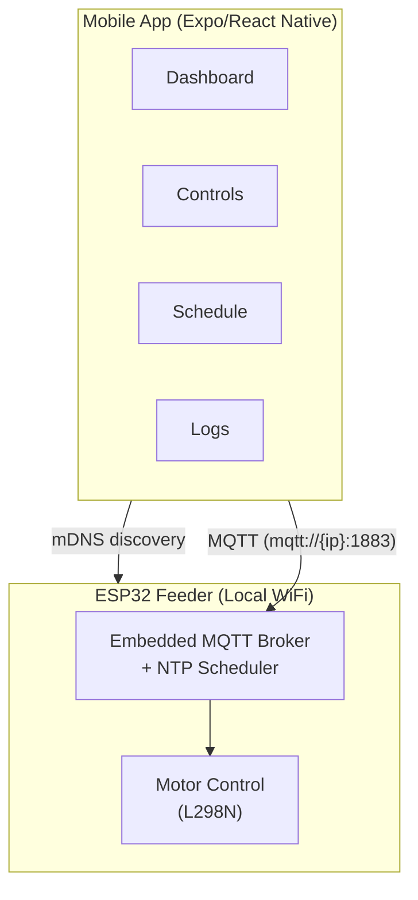

# Floyd Feeder

Control your fish feeder from your phone on the same WiFi. A local-only IoT system with a React Native app and ESP32-based feeder hardware.

```
Mobile App (Expo/RN) ←→ ESP32 Feeder (embedded MQTT broker + scheduler)
                   (same WiFi network, mDNS discovery)
```

No cloud. No accounts. No internet required.

---

## Quick Start

```bash
npm install
npx expo start
```

To connect to your feeder:
1. Power on the ESP32 — it creates a `FloydFeeder-{id}` WiFi AP
2. In the app, go to **Set Up Feeder** and enter your home WiFi credentials
3. The feeder joins your WiFi and the app discovers it automatically

---

## Architecture



---

## Components

| Component | Stack |
|-----------|-------|
| **Mobile App** | React Native 0.83 + Expo SDK 55 + Expo Router |
| **IoT Firmware** | Arduino (ESP32) + sMQTTBroker + WiFiManager + ezTime |

**No server to run.** All data lives on-device (AsyncStorage) or on the ESP32 (NVS).

### Key Libraries

- `expo-router` — file-based navigation
- `mqtt` v5 — MQTT client (plaintext, local LAN)
- `react-native-zeroconf` — mDNS feeder discovery
- `react-native-reanimated` — animations
- `react-native-webview` — WiFi provisioning portal
- `@react-native-async-storage/async-storage` — feed log persistence

---

## Development

```bash
# Mobile app
npm install
npx expo start
```

**No environment variables needed.** The app discovers the feeder automatically via mDNS on your local WiFi.

---

## Project Structure

```
floyd-app/
├── app/                  # Expo Router screens
│   ├── (tabs)/           # Dashboard, Controls, Schedule, Logs
│   └── provision.tsx     # WiFi provisioning wizard
├── components/           # Reusable UI components
│   └── ui/               # CircularProgress, StatCard, Skeleton, etc.
├── hooks/                # useMQTT, useESP32Context, useMDNS, useScheduleMQTT, useAlerts
├── constants/Colors.ts   # Light/dark theme
├── ESP32_MQTT_Server.ino # ESP32 firmware (embedded broker + scheduler)
└── docs/
```

---

## Hardware

| Component | Purpose |
|-----------|---------|
| ESP32 Dev Module | WiFi + embedded MQTT broker + scheduler |
| L298N H-Bridge | Drives auger + impeller motors |
| HC-SR04 | Ultrasonic food level sensor (not currently connected) |
| DS18B20 | Waterproof temperature sensor (not currently connected) |

---

## ESP32 Firmware

Flash `ESP32_MQTT_Server.ino` via Arduino IDE. Required libraries:

| Library | Purpose |
|---------|---------|
| WiFiManager | SoftAP provisioning portal |
| ArduinoJson | JSON parsing/serialization |
| sMQTTBroker | Embedded MQTT broker (port 1883) |
| ESPmDNS | mDNS service advertising |
| ezTime | NTP time synchronization |

See `docs/ESP32_Setup_Guide.md` for detailed setup.

---

## Deployment

**App:** Build with EAS:
```bash
npx eas build --platform android --profile production
npx eas build --platform ios --profile production
```

**ESP32:** Flash via Arduino IDE (NodeMCU-32S, 115200 baud, 4MB flash). Provisioning happens through the app — no pre-configuration needed.

---

## License

MIT
