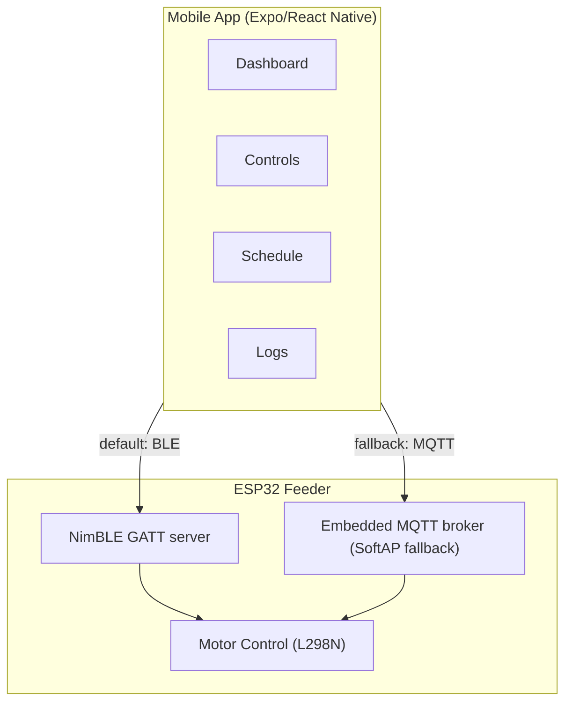

# Floyd Feeder

Control your fish feeder from your phone. A local-only IoT system with a React Native app and ESP32-based feeder hardware.

```
Mobile App (Expo/RN) ←BLE GATT→ ESP32 (default)
Mobile App (Expo/RN) ←MQTT→ ESP32 SoftAP + broker (manual fallback)
```

No cloud. No accounts. No internet required.

---

## Quick Start

```bash
npm install
npx expo start
```

**Requires a dev client or native build** — `react-native-ble-plx` is not available in Expo Go. Use `npx expo run:android` / `npx expo run:ios` after `npx expo prebuild` if needed.

To connect to your feeder:

1. Power on the ESP32 — it advertises over Bluetooth as `FloydFeeder-{chipId}` (primary).
2. Open the app, scan, and tap your feeder to pair (chip ID is stored on the phone).
3. Optional fallback: from the connection card, use **Connect via Wi‑Fi** to put the device in SoftAP mode, join `FloydFeeder-{chipId}` in system Wi‑Fi settings, then tap **Connect** in the app (MQTT `192.168.4.1:1883`).

---

## Architecture



---

## Components

| Component | Stack |
|-----------|-------|
| **Mobile App** | React Native 0.83 + Expo SDK 55 + Expo Router |
| **IoT Firmware** | Arduino (ESP32) + NimBLE + sMQTTBroker |

**No server to run.** All data lives on-device (AsyncStorage) or on the ESP32 (NVS).

### Key Libraries

- `expo-router` — file-based navigation
- `react-native-ble-plx` — Bluetooth Low Energy (primary transport)
- `mqtt` v5 — MQTT client for SoftAP fallback
- `react-native-reanimated` — animations
- `@react-native-async-storage/async-storage` — feed log + chip ID persistence

---

## Development

```bash
# Mobile app
npm install
npx expo start
```

Use a development build with native modules (BLE). Android requires Bluetooth permissions; iOS requires Bluetooth usage strings (set in `app.json` via the BLE config plugin).

---

## Project Structure

```
floyd-app/
├── app/                  # Expo Router screens
│   └── (tabs)/           # Dashboard, Controls, Schedule, Logs
├── components/           # Reusable UI components
│   └── ui/               # CircularProgress, StatCard, Skeleton, etc.
├── hooks/                # useMQTT, useBLETransport, useESP32Context, useScheduleMQTT, useAlerts
├── constants/Colors.ts   # Light/dark theme
├── ESP32_MQTT_Server.ino # ESP32 firmware (NimBLE + SoftAP broker)
└── docs/
```

---

## Hardware

| Component | Purpose |
|-----------|---------|
| ESP32 Dev Module | BLE + WiFi SoftAP + embedded MQTT broker + scheduler |
| L298N H-Bridge | Drives auger + impeller motors |
| HC-SR04 | Ultrasonic food level sensor (not currently connected) |
| DS18B20 | Waterproof temperature sensor (not currently connected) |

---

## ESP32 Firmware

Flash `ESP32_MQTT_Server.ino` via Arduino IDE. Enable **NimBLE** in the ESP32 Arduino core (Bluetooth mode). Required libraries:

| Library | Purpose |
|---------|---------|
| NimBLE-Arduino | BLE GATT server (`NimBLEDevice.h`) |
| ArduinoJson | JSON parsing/serialization |
| sMQTTBroker | Embedded MQTT broker (port 1883, SoftAP mode only) |

Scheduler time is set from the phone over BLE (Unix timestamp on the Time characteristic) or via MQTT when in SoftAP mode — there is no NTP or home-WiFi STA mode in this revision.

See `ESP32_Setup_Guide.md` for wiring and IDE notes.

---

## Deployment

**App:** Build with EAS:

```bash
npx eas build --platform android --profile production
npx eas build --platform ios --profile production
```

**ESP32:** Flash via Arduino IDE (NodeMCU-32S, 115200 baud, 4MB flash). First connection is two-tap BLE setup in the app.

---

## License

MIT
