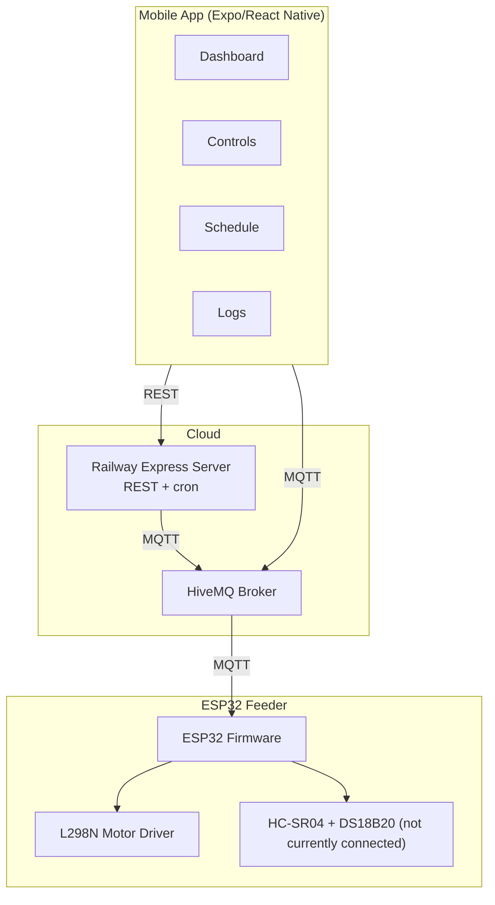

# Floyd Feeder

Control your fish feeder from anywhere. A cloud-connected IoT system with a React Native app, Express API server, and ESP32-based feeder hardware.

```
Mobile App (Expo/RN) ↔ HiveMQ MQTT Broker ↔ ESP32 Feeder
                     ↔ Railway Express Server (REST APIs + cron scheduling)
```

---

## Quick Start

```bash
npm install
npx expo start
```

---

## Architecture



---

## Components

| Component | Stack |
|-----------|-------|
| **Mobile App** | React Native 0.83 + Expo SDK 55 + Expo Router |
| **Cloud Server** | Node.js + Express + Prisma + SQLite |
| **IoT Firmware** | Arduino (ESP32) + PubSubClient + WiFiManager |
| **MQTT Broker** | HiveMQ Cloud (public or dedicated cluster) |

### Key Libraries

- `expo-router` — file-based navigation
- `mqtt` v5 — MQTT client
- `react-native-reanimated` — animations
- `react-native-webview` — WiFi provisioning portal
- `@prisma/client` — database ORM
- `node-cron` — feed schedule execution

---

## Development

```bash
# Mobile app
npm install
npx expo start

# Server
cd server && npm install && npm run dev
```

### Environment

| Variable | Default | Where |
|----------|---------|-------|
| `EXPO_PUBLIC_MQTT_BROKER_URL` | `mqtts://broker.hivemq.com:8883` | App `.env` |
| `MQTT_BROKER_URL` | `mqtt://broker.hivemq.com:1883` | Server `.env` |
| `DATABASE_URL` | `file:./prisma/floyd.db` | Server `.env` |

---

## Project Structure

```
floyd-app/
├── app/                  # Expo Router screens
│   ├── (tabs)/           # Dashboard, Controls, Schedule, Logs
│   └── provision.tsx     # WiFi provisioning wizard
├── components/           # Reusable UI components
│   └── ui/               # CircularProgress, StatCard, Skeleton, etc.
├── hooks/                # useMQTT, useESP32Context, useAlerts
├── services/api.ts       # REST API client
├── constants/Colors.ts   # Light/dark theme
├── server/               # Express cloud API
│   ├── prisma/schema.prisma
│   └── src/services/     # mqttClient.ts, scheduler.ts, db.ts
├── ESP32_MQTT_Server.ino
└── docs/
```

---

## Hardware

| Component | Purpose |
|-----------|---------|
| ESP32 Dev Module | WiFi + BLE + MQTT microcontroller |
| L298N H-Bridge | Drives auger + impeller motors |
| HC-SR04 | Ultrasonic food level sensor (not currently connected) |
| DS18B20 | Waterproof temperature sensor (not currently connected) |

---

## Deployment

**Server:** Deploy `server/` to Railway. Set env vars. Run `npx prisma migrate deploy`.

**App:** Build with EAS (`npx eas build --platform android --profile production`).

See `docs/floyd-feeder-manual-setup.md` for full setup walkthrough.

---

## License

MIT
