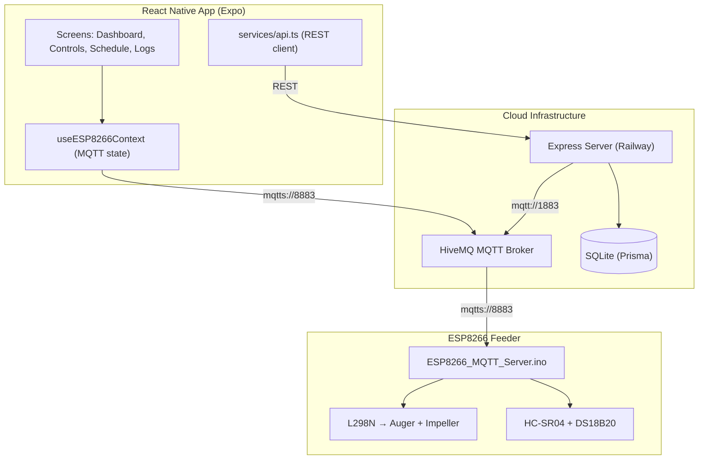

# Floyd Feeder — Codebase Documentation

Cloud-connected IoT fish feeder: React Native mobile app + Express cloud server + ESP8266 MQTT firmware.

---

## 1. Architecture



---

## 2. Data Flow

MQTT topics under `floyd/devices/{chipId}/`:

| Topic | Direction | Payload |
|-------|-----------|---------|
| `telemetry` | ESP → App + Server | Sensor data (temp, distance, food%) |
| `status` | ESP → App + Server | Connection state (retained) |
| `command` | App + Server → ESP | `start_feed`, `stop_feed`, `clear_jam`, `get_sensors` |
| `response` | ESP → App + Server | `feed_complete`, `jam_clear_complete`, errors |
| `config` | App → ESP | Geometry/interval changes |

The app and server communicate RESTfully for CRUD operations (schedules, devices, history).

---

## 3. Directory Structure

```
floyd-app/
├── app/                        # Expo Router pages
│   ├── _layout.tsx             # Root providers (GestureHandler, MQTT context, Theme)
│   ├── +not-found.tsx          # 404 screen
│   ├── provision.tsx           # WebView-based WiFi provisioning
│   └── (tabs)/
│       ├── _layout.tsx         # Bottom tab navigator config
│       ├── index.tsx           # Dashboard — sensor data, alerts, connection status
│       ├── controls.tsx        # Manual feed — speed sliders, FEED/STOP/CLEAR JAM
│       ├── schedule.tsx        # Schedule CRUD — time picker, day toggles
│       └── history.tsx         # Feed logs, sensor history, alerts
├── components/
│   ├── ESP8266Connection.tsx   # MQTT connection card (connect/disconnect/provision)
│   ├── ThemedText.tsx          # Theme-aware text component
│   ├── ThemedView.tsx          # Theme-aware view component
│   ├── HapticTab.tsx           # Haptic feedback tab button
│   ├── ExternalLink.tsx        # In-app browser link
│   └── ui/
│       ├── IconSymbol.tsx      # SF Symbols → MaterialIcons mapping
│       ├── StatCard.tsx        # Animated metric card
│       ├── CircularProgress.tsx# Animated circular gauge (food level)
│       ├── AnimatedValue.tsx   # Animated number transitions
│       ├── Skeleton.tsx        # Loading skeletons
│       ├── AlertItem.tsx       # Alert display row
│       ├── AnimatedButton.tsx  # Animated pressable button
│       ├── BatteryLevel.tsx    # Battery indicator
│       ├── CustomSlider.tsx    # Custom slider control
│       ├── DistanceSensor.tsx  # Distance reading display
│       ├── ErrorToast.tsx      # Error toast notification
│       ├── InlineError.tsx     # Inline error/status badges
│       ├── PaddleControl.tsx   # Paddle-style widget
│       ├── VerticalSlider.tsx  # Vertical orientation slider
│       ├── TabBarBackground.tsx# Tab bar background (cross-platform)
│       └── TabButton.tsx       # Tab bar button
├── hooks/
│   ├── useMQTT.ts             # Core MQTT connection (mqtt.js v5)
│   ├── useESP8266Context.tsx   # MQTT context provider + device state
│   ├── useAlerts.ts           # Derived alerts from sensor data
│   ├── useColorScheme.ts      # Light/dark scheme hook
│   ├── useThemeColor.ts       # Theme color resolver
│   └── useMountEffect.ts      # Mount-only effect
├── services/
│   └── api.ts                 # REST client for cloud API
├── constants/
│   └── Colors.ts              # Light + dark marine green palette
├── server/
│   ├── prisma/
│   │   └── schema.prisma      # DB schema: Device, FeedSchedule, FeedLog, AlertConfig
│   └── src/
│       ├── server.ts           # Express app + REST endpoints
│       ├── types/index.ts      # TypeScript interfaces + type guards
│       └── services/
│           ├── db.ts           # Prisma singleton
│           ├── mqttClient.ts   # MQTT handler (publish/subscribe)
│           └── scheduler.ts    # Cron-based feed execution
├── ESP8266_MQTT_Server.ino    # ESP8266 firmware (L298N + HC-SR04 + DS18B20)
└── docs/
    ├── floyd-feeder-manual-setup.md
    ├── floyd-feeder-electronics-setup.md
    └── plans/                  # Architecture plans (excluded from updates)
```

---

## 4. Features

| Feature | Description |
|---------|-------------|
| **Device Provisioning** | WiFiManager captive portal via WebView; auto-claim device via API |
| **Live Dashboard** | Connection status, food level gauge, temperature, motor state, alerts |
| **Manual Controls** | Auger/impeller speed sliders, feed duration, FEED/STOP/CLEAR JAM |
| **Feeding Schedules** | Full CRUD with time picker, day-of-week, enable/disable |
| **History & Logs** | Feed history from server, real-time sensor log, alert log |
| **Cloud Scheduling** | Server-side cron triggers feed via MQTT |
| **Alert System** | Low/critical food, high/low temp, sensor disconnect |
| **Light/Dark Theme** | Marine green palette, full light and dark mode |
| **Cross-Platform** | iOS, Android, Web |

---

## 5. REST API (Server)

| Endpoint | Method | Purpose |
|----------|--------|---------|
| `/health` | GET | Health check + MQTT status |
| `/api/devices/claim` | POST | Register a new feeder device |
| `/api/devices` | GET | List claimed devices |
| `/api/schedules` | GET/POST | List/create feed schedules |
| `/api/schedules/:id` | PUT/DELETE | Update/delete schedule |
| `/api/history` | GET | Feed history (with `?limit=N`) |
| `/api/alerts/config` | GET/PUT | Read/update alert thresholds |

---

## 6. MQTT Protocol

### Commands (App/Server → ESP)

```json
{"action":"start_feed","augerSpeed":768,"impellerSpeed":1023,"preSpinMs":1500,"feedMs":3000,"postSpinMs":1500}
{"action":"stop_feed"}
{"action":"clear_jam","speed":512,"duration":2000}
{"action":"get_sensors"}
{"action":"set_sensor_interval","interval":5000}
{"action":"ping"}
```

### Telemetry (ESP → App/Server)

```json
{"type":"sensor_data","data":{"temperature":24.5,"distance":18.2,"foodLevelPercentage":73,"motorState":"idle"}}
{"type":"control_response","data":{"action":"feed_complete","success":true,"motorState":"idle"}}
{"type":"status","data":{"connected":true,"uptime":3600,"wifiRSSI":-65,"freeHeap":28000}}
```

---

## 7. ESP8266 Firmware

- **File:** `ESP8266_MQTT_Server.ino`
- **Connectivity:** WiFiManager (SoftAP provisioning) → PubSubClient (MQTT)
- **Motor Control:** L298N dual H-bridge — auger (Motor A) + impeller (Motor B)
- **Sensors:** HC-SR04 ultrasonic (food level via container geometry), DS18B20 (temperature)
- **State Machine:** IDLE → PRE_SPIN → FEEDING → POST_SPIN → IDLE (with JAM_CLEAR and STOPPING states)
- **Persistence:** EEPROM stores WiFi creds, MQTT config, container geometry
- **TLS:** BearSSL WiFiClientSecure with `setInsecure()` for HiveMQ Cloud

### Pin Mapping

| Pin | GPIO | Connection |
|-----|------|------------|
| D0 | GPIO16 | L298N IN4 (Impeller Dir 4) |
| D1 | GPIO5 | HC-SR04 TRIG |
| D2 | GPIO4 | HC-SR04 ECHO (via voltage divider) |
| D3 | GPIO0 | L298N ENB (Impeller PWM) |
| D4 | GPIO2 | DS18B20 DQ (4.7kΩ pull-up) |
| D5 | GPIO14 | L298N ENA (Auger PWM) |
| D6 | GPIO12 | L298N IN1 (Auger Dir 1) |
| D7 | GPIO13 | L298N IN2 (Auger Dir 2) |
| D8 | GPIO15 | L298N IN3 (Impeller Dir 3) |

---

## 8. Deployment

**Server:** Deploy `server/` to Railway with `DATABASE_URL`, `PORT`, `MQTT_BROKER_URL` env vars. Run `npx prisma migrate deploy` after first deploy.

**App:** Build with EAS:
```bash
npx eas build --platform android --profile production
npx eas build --platform ios --profile production
```

**ESP8266:** Flash via Arduino IDE (NodeMCU 1.0, 115200 baud, 4MB flash).
