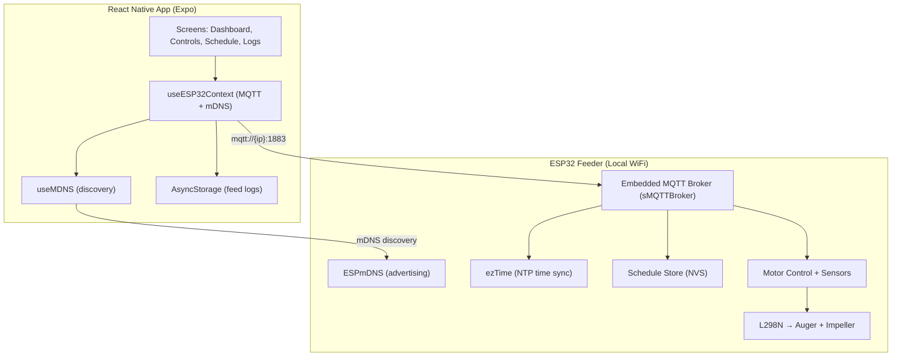

# Floyd Feeder — Codebase Documentation

Local WiFi fish feeder: React Native mobile app + ESP32 firmware with embedded MQTT broker.

---

## 1. Architecture



**No cloud dependencies.** The ESP32 runs an embedded MQTT broker on port 1883 and advertises itself via mDNS as `floyd-feeder-{chipId}.local`. The app discovers it on the same WiFi network and connects directly.

---

## 2. Data Flow

MQTT topics under `floyd/devices/{chipId}/`:

| Topic | Direction | Payload |
|-------|-----------|---------|
| `telemetry` | ESP → App | Sensor data (temp, distance, food%) |
| `status` | ESP → App | Connection state (retained) |
| `command` | App → ESP | `start_feed`, `stop_feed`, `clear_jam`, `get_sensors`, `get_schedules`, `set_schedules` |
| `response` | ESP → App | `feed_complete`, `jam_clear_complete`, `schedules_list`, errors |

All communication is local WiFi (no internet required after provisioning). Feed history is persisted on-device via AsyncStorage.

---

## 3. Directory Structure

```
floyd-app/
├── app/                        # Expo Router pages
│   ├── _layout.tsx             # Root providers (GestureHandler, MQTT context, Theme)
│   ├── +not-found.tsx          # 404 screen
│   ├── provision.tsx           # WebView-based WiFi provisioning (no cloud claim)
│   └── (tabs)/
│       ├── _layout.tsx         # Bottom tab navigator config
│       ├── index.tsx           # Dashboard — sensor data, alerts, connection status
│       ├── controls.tsx        # Manual feed — speed sliders, FEED/STOP/CLEAR JAM
│       ├── schedule.tsx        # Schedule CRUD via MQTT — time picker, day toggles
│       └── history.tsx         # Feed logs from AsyncStorage, sensor history, alerts
├── components/
│   ├── ESP32Connection.tsx   # LAN connection card (mDNS scan/disconnect/reconfigure)
│   └── ui/                     # Reusable UI components
├── hooks/
│   ├── useMQTT.ts              # Core MQTT connection (mqtt.js v5, plaintext mqtt://)
│   ├── useESP32Context.tsx    # Context provider: mDNS discovery + MQTT + feed logs
│   ├── useMDNS.ts             # mDNS feeder discovery (react-native-zeroconf)
│   ├── useScheduleMQTT.ts     # Schedule CRUD over MQTT
│   ├── useAlerts.ts            # Derived alerts from sensor data
│   └── useMountEffect.ts       # Mount-only effect
├── constants/
│   └── Colors.ts              # Light + dark marine green palette
├── ESP32_MQTT_Server.ino    # ESP32 firmware (embedded broker + scheduler + motor)
└── docs/
    ├── plans/                  # Architecture plans
    ├── ESP32_Pin_Layout_Optimization.md
    └── ESP32_Setup_Guide.md
```

---

## 4. Features

| Feature | Description |
|---------|-------------|
| **Device Provisioning** | WiFiManager captive portal via WebView; local-only, no cloud claim |
| **Live Dashboard** | Connection status, food level gauge, temperature, motor state, alerts |
| **Manual Controls** | Auger/impeller speed sliders, feed duration, FEED/STOP/CLEAR JAM |
| **Feeding Schedules** | Full CRUD over MQTT; ESP32-side cron with NTP time sync |
| **History & Logs** | Feed logs persisted in AsyncStorage, real-time sensor log, alert log |
| **Alert System** | Low/critical food, high/low temp, sensor disconnect |
| **Light/Dark Theme** | Marine green palette, full light and dark mode |
| **Cross-Platform** | iOS, Android, Web |
| **mDNS Discovery** | Auto-discovers feeder on same WiFi via `floyd-feeder-{chipId}.local` |

---

## 5. Schedule CRUD via MQTT

Schedules are stored on the ESP32 in NVS (Preferences) and synced via MQTT commands:

**Get schedules:**
```json
{"action":"get_schedules"}
```
Response:
```json
{"type":"schedules_list","data":[{"id":"abc123","label":"Morning","time":"08:00","daysOfWeek":"0,1,2,3,4,5,6","augerSpeed":768,"impellerSpeed":1023,"preSpinMs":1500,"feedMs":3000,"postSpinMs":1500,"enabled":true}]}
```

**Set schedules (full sync):**
```json
{"action":"set_schedules","parameters":{"schedules":[...]}}
```

---

## 6. MQTT Protocol

### Commands (App → ESP)

```json
{"action":"start_feed","parameters":{"augerSpeed":768,"impellerSpeed":1023,"preSpinMs":1500,"feedMs":3000,"postSpinMs":1500}}
{"action":"stop_feed"}
{"action":"clear_jam","parameters":{"speed":768,"duration":2000}}
{"action":"get_sensors"}
{"action":"set_sensor_interval","parameters":{"interval":5000}}
{"action":"get_schedules"}
{"action":"set_schedules","parameters":{"schedules":[...]}}
{"action":"ping"}
{"action":"restart_provisioning"}
```

### Telemetry (ESP → App)

```json
{"type":"sensor_data","data":{"temperature":24.5,"distance":18.2,"foodLevelPercentage":73,"motorState":"idle"}}
{"type":"control_response","data":{"action":"feed_complete","success":true,"motorState":"idle"}}
{"type":"status","data":{"connected":true,"uptime":3600,"wifiRssi":-65,"freeHeap":28000}}
{"type":"schedules_list","data":[...]}
```

---

## 7. ESP32 Firmware

- **File:** `ESP32_MQTT_Server.ino`
- **Connectivity:** WiFiManager (SoftAP provisioning) → Embedded sMQTTBroker (port 1883)
- **Discovery:** ESPmDNS advertising as `floyd-feeder-{chipId}.local` (MQTT service on TCP 1883)
- **Time Sync:** ezTime NTP client (default: Asia/Shanghai, configurable)
- **Motor Control:** L298N dual H-bridge — auger (Motor A) + impeller (Motor B)
- **Scheduling:** Cron engine in firmware; schedules persisted in NVS
- **State Machine:** IDLE → PRE_SPIN → FEEDING → POST_SPIN → IDLE (with JAM_CLEAR and STOPPING states)
- **Persistence:** Preferences (NVS) stores WiFi creds, container geometry, schedules

### Arduino Libraries Required

| Library | Purpose |
|---------|---------|
| WiFiManager | SoftAP provisioning portal |
| ArduinoJson | JSON parsing/serialization |
| sMQTTBroker | Embedded MQTT broker |
| ESPmDNS | mDNS service advertising |
| ezTime | NTP time synchronization |

---

## 8. Deployment

**App:** Build with EAS:
```bash
npx eas build --platform android --profile production
npx eas build --platform ios --profile production
```

**ESP32:** Flash via Arduino IDE (NodeMCU-32S, 115200 baud, 4MB flash). No cloud configuration needed — the feeder operates entirely on the local WiFi network.

**Provisioning flow:**
1. Phone connects to `FloydFeeder-{chipId}` WiFi AP
2. WebView opens `192.168.4.1` — enter home WiFi credentials
3. Feeder connects to home WiFi, starts mDNS + MQTT broker
4. App discovers feeder via mDNS and connects
