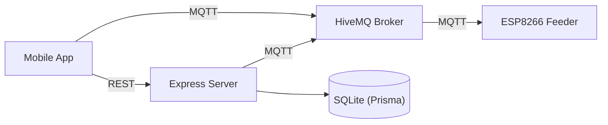

# Floyd Feeder — Cloud Server

Express + TypeScript backend powering the Floyd IoT fish feeder system. Handles REST APIs, MQTT messaging, and cron-based feed scheduling.

---

## Quick Start

```bash
cd server
npm install
npm run dev
```

---

## Architecture



The server does not relay real-time messages. The app and ESP8266 communicate directly through MQTT. The server provides REST endpoints for device management, feed schedules, history, and alert configuration, and runs cron jobs to trigger scheduled feeds via MQTT.

---

## REST API

### Health

```
GET /health
→ {"status":"ok","uptime":3600,"mqttConnected":true}
```

### Devices

```
POST /api/devices/claim
  Body: {"chipId":"A1B2C3","name":"Kitchen Feeder","mqttPassword":"abc123"}
  → 201 {"id":1,"chipId":"A1B2C3","name":"Kitchen Feeder"}

GET /api/devices
  → [{"id":1,"chipId":"A1B2C3","name":"Kitchen Feeder","claimedAt":"..."}]
```

### Schedules

```
GET /api/schedules
POST /api/schedules
  Body: {"label":"Morning Feed","time":"08:00","daysOfWeek":"1,2,3,4,5","augerSpeed":768,"impellerSpeed":1023,"feedMs":5000}
PUT /api/schedules/:id
DELETE /api/schedules/:id
```

### History

```
GET /api/history?limit=50
→ [{"id":1,"timestamp":"...","feedMs":5000,"success":true}]
```

### Alerts

```
GET /api/alerts/config
PUT /api/alerts/config
  Body: {"lowFoodPct":25,"criticalFoodPct":10,"tempMin":5,"tempMax":35}
```

---

## Database

SQLite via Prisma ORM — 4 models:

| Model | Key Fields |
|-------|-----------|
| `Device` | id, chipId (unique), name, mqttPassword |
| `FeedSchedule` | id, label, enabled, time, daysOfWeek, speeds, feedMs |
| `FeedLog` | id, timestamp, feedMs, speeds, success, errorMessage |
| `AlertConfig` | id (singleton), lowFoodPct, criticalFoodPct, tempMin, tempMax |

---

## Environment Variables

| Variable | Default | Required |
|----------|---------|----------|
| `PORT` | `3001` | No |
| `DATABASE_URL` | `file:./prisma/floyd.db` | Yes |
| `MQTT_BROKER_URL` | `mqtt://broker.hivemq.com:1883` | No |
| `MQTT_USERNAME` | (empty) | Only for private HiveMQ clusters |
| `MQTT_PASSWORD` | (empty) | Only for private HiveMQ clusters |

---

## Deployment (Railway)

1. Create Railway project from GitHub (root directory: `server/`)
2. Set environment variables in Railway dashboard
3. Mount a volume at `server/prisma` for SQLite persistence
4. After first deploy, run: `npx prisma migrate deploy`
5. Verify: `GET https://your-app.up.railway.app/health`

---

## Development

```bash
npm run dev      # tsx watch — hot reload
npm run build    # TypeScript → dist/
npm start        # Production
```
